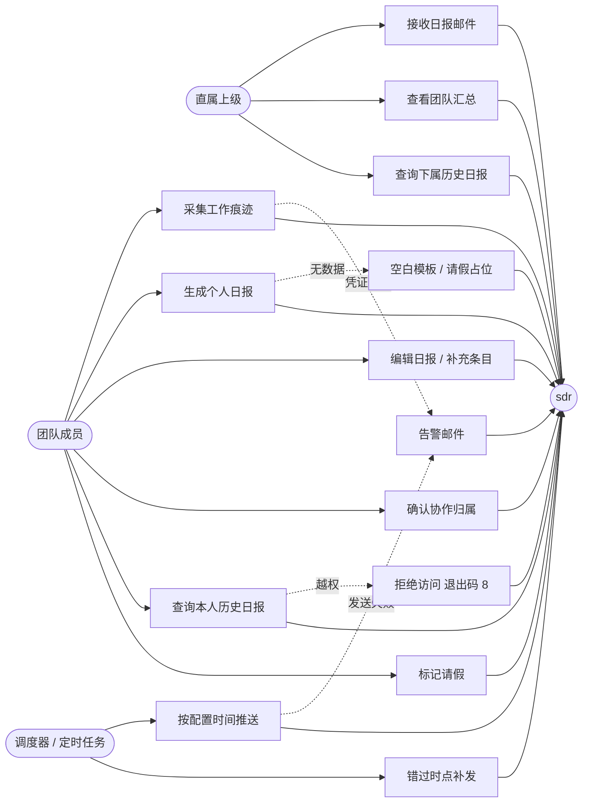

# 用例图（Mermaid 源文件）

> T-023 交付物：用例视角。角色与用例对应 proposal §6 验收标准；
> 模块落点见 [类图](./02-class.md)。

```mermaid
flowchart LR
    Member([团队成员])
    Manager([直属上级])
    Scheduler([调度器 / 定时任务])
    System((sdr))

    Member --> UC1[采集工作痕迹]
    Member --> UC2[生成个人日报]
    Member --> UC3[编辑日报 / 补充条目]
    Member --> UC4[确认协作归属]
    Member --> UC5[查询本人历史日报]
    Member --> UC6[标记请假]

    Manager --> UC7[接收日报邮件]
    Manager --> UC8[查看团队汇总]
    Manager --> UC9[查询下属历史日报]

    Scheduler --> UC10[按配置时间推送]
    Scheduler --> UC11[错过时点补发]

    UC1 -.凭证失效.-> UC12[告警邮件]
    UC10 -.发送失败.-> UC12
    UC2 -.无数据.-> UC13[空白模板 / 请假占位]
    UC5 -.越权.-> UC14[拒绝访问 退出码 8]

    UC1 --> System
    UC2 --> System
    UC3 --> System
    UC4 --> System
    UC5 --> System
    UC6 --> System
    UC7 --> System
    UC8 --> System
    UC9 --> System
    UC10 --> System
    UC11 --> System
    UC12 --> System
    UC13 --> System
    UC14 --> System
```
