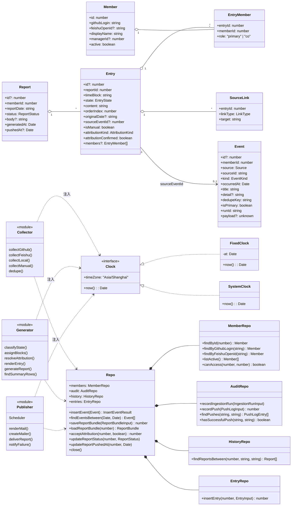

# 类图（Mermaid 源文件）

> T-023 交付物：与 `v1/src/` 实际模块一致，含 `EntryMember` 与 `Clock`。
> `Clock` 为注入端口，`Repo` 聚合 member/audit/history/entries 四个同库子仓储。

```mermaid
classDiagram
    direction LR

    class Clock {
        <<interface>>
        +timeZone: "Asia/Shanghai"
        +now(): Date
    }
    class FixedClock {
        -at: Date
        +now(): Date
    }
    class SystemClock {
        +now(): Date
    }
    Clock <|.. FixedClock
    Clock <|.. SystemClock

    class Event {
        +id?: number
        +memberId: number
        +source: Source
        +sourceId: string
        +kind: EventKind
        +occurredAt: Date
        +title: string
        +detail?: string
        +dedupeKey: string
        +isPrimary: boolean
        +runId: string
        +payload?: unknown
    }

    class Report {
        +id?: number
        +memberId: number
        +reportDate: string
        +status: ReportStatus
        +body?: string
        +generatedAt: Date
        +pushedAt?: Date
    }

    class Entry {
        +id?: number
        +reportId: number
        +timeBlock: string
        +state: EntryState
        +content: string
        +orderIndex: number
        +originalDate?: string
        +sourceEventId?: number
        +isManual: boolean
        +attributionKind: AttributionKind
        +attributionConfirmed: boolean
        +members?: EntryMember[]
    }

    class EntryMember {
        +entryId: number
        +memberId: number
        +role: "primary" | "co"
    }

    class SourceLink {
        +entryId: number
        +linkType: LinkType
        +target: string
    }

    class Member {
        +id: number
        +githubLogin: string
        +feishuOpenId?: string
        +displayName: string
        +managerId?: number
        +active: boolean
    }

    Report "1" o-- "*" Entry
    Entry "1" o-- "*" EntryMember
    Member "1" o-- "*" EntryMember
    Entry "1" o-- "*" SourceLink
    Entry "0..1" --> "0..1" Event : sourceEventId

    class Repo {
        +members: MemberRepo
        +audit: AuditRepo
        +history: HistoryRepo
        +entries: EntryRepo
        +insertEvent(Event) InsertEventResult
        +findEventsBetween(Date, Date) Event[]
        +saveReportBundle(ReportBundleInput) number
        +loadReportBundle(number) ReportBundle
        +acceptAttribution(number, boolean) number
        +updateReportStatus(number, ReportStatus)
        +updateReportPushedAt(number, Date)
        +close()
    }
    class MemberRepo {
        +findById(number) Member
        +findByGithubLogin(string) Member
        +findByFeishuOpenId(string) Member
        +listActive() Member[]
        +canAccess(number, number) boolean
    }
    class AuditRepo {
        +recordIngestionRun(IngestionRunInput)
        +recordPush(PushLogInput) number
        +findPushes(string, string) PushLogEntry[]
        +hasSuccessfulPush(string, string) boolean
    }
    class HistoryRepo {
        +findReportsBetween(number, string, string) Report[]
    }
    class EntryRepo {
        +insertEntry(number, EntryInput) number
    }
    Repo *-- MemberRepo
    Repo *-- AuditRepo
    Repo *-- HistoryRepo
    Repo *-- EntryRepo

    class Collector {
        <<module>>
        collectGithub()
        collectFeishu()
        collectLocal()
        collectManual()
        dedupe()
    }
    class Generator {
        <<module>>
        classifyState()
        assignBlocks()
        resolveAttribution()
        renderEntry()
        generateReport()
        findSummaryRows()
    }
    class Publisher {
        <<module>>
        renderMail()
        createMailer()
        deliverReport()
        notifyFailure()
        Scheduler
    }

    Collector ..> Clock : 注入
    Generator ..> Clock : 注入
    Publisher ..> Clock : 注入
    Collector ..> Repo
    Generator ..> Repo
    Publisher ..> Repo
```
