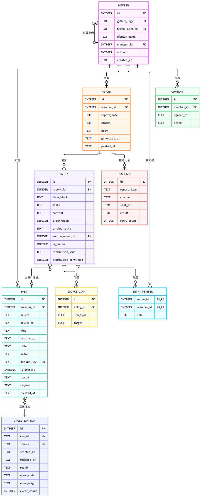
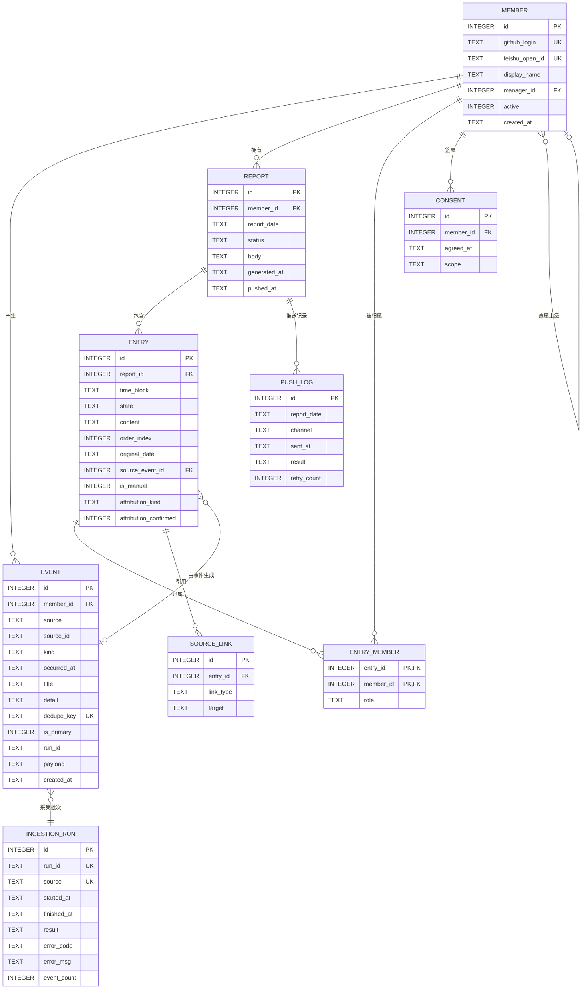

# ER 图（Mermaid 源文件）

> T-023 交付物：包含 9 张表（`store/schema.ts`）。

> 上图为 ER 图（渲染图），由下方 Mermaid 源码经 mermaid-cli 12.2 渲染（2026-11-26）。

```mermaid
erDiagram
    MEMBER ||--o{ EVENT : "产生"
    MEMBER ||--o{ REPORT : "拥有"
    MEMBER ||--o{ ENTRY_MEMBER : "被归属"
    MEMBER ||--o{ CONSENT : "签署"
    MEMBER }o--o| MEMBER : "直属上级"
    REPORT ||--o{ ENTRY : "包含"
    REPORT ||--o{ PUSH_LOG : "推送记录"
    ENTRY ||--o{ ENTRY_MEMBER : "归属"
    ENTRY ||--o{ SOURCE_LINK : "引用"
    ENTRY }o--o| EVENT : "由事件生成"
    EVENT }o--|| INGESTION_RUN : "采集批次"

    MEMBER {
        INTEGER id PK
        TEXT github_login UK
        TEXT feishu_open_id UK
        TEXT display_name
        INTEGER manager_id FK
        INTEGER active
        TEXT created_at
    }
    EVENT {
        INTEGER id PK
        INTEGER member_id FK
        TEXT source
        TEXT source_id
        TEXT kind
        TEXT occurred_at
        TEXT title
        TEXT detail
        TEXT dedupe_key UK
        INTEGER is_primary
        TEXT run_id
        TEXT payload
        TEXT created_at
    }
    REPORT {
        INTEGER id PK
        INTEGER member_id FK
        TEXT report_date
        TEXT status
        TEXT body
        TEXT generated_at
        TEXT pushed_at
    }
    ENTRY {
        INTEGER id PK
        INTEGER report_id FK
        TEXT time_block
        TEXT state
        TEXT content
        INTEGER order_index
        TEXT original_date
        INTEGER source_event_id FK
        INTEGER is_manual
        TEXT attribution_kind
        INTEGER attribution_confirmed
    }
    ENTRY_MEMBER {
        INTEGER entry_id PK, FK
        INTEGER member_id PK, FK
        TEXT role
    }
    SOURCE_LINK {
        INTEGER id PK
        INTEGER entry_id FK
        TEXT link_type
        TEXT target
    }
    INGESTION_RUN {
        INTEGER id PK
        TEXT run_id UK
        TEXT source UK
        TEXT started_at
        TEXT finished_at
        TEXT result
        TEXT error_code
        TEXT error_msg
        INTEGER event_count
    }
    PUSH_LOG {
        INTEGER id PK
        TEXT report_date
        TEXT channel
        TEXT sent_at
        TEXT result
        INTEGER retry_count
    }
    CONSENT {
        INTEGER id PK
        INTEGER member_id FK
        TEXT agreed_at
        TEXT scope
    }
```
